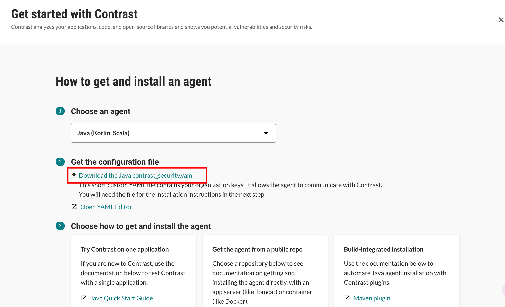
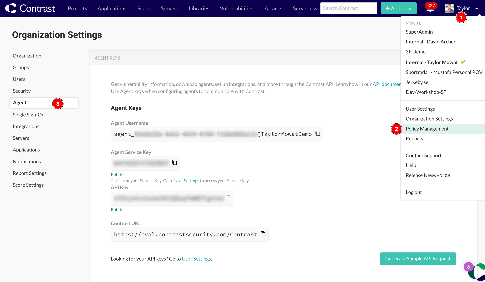
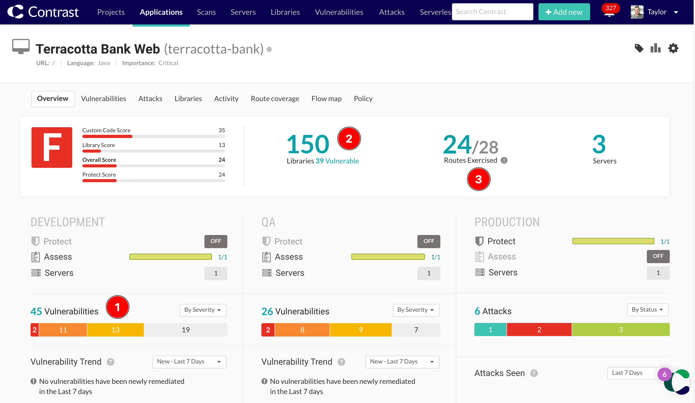

# Contrast Security Instrumentation Workshop: Spring PetClinic

## Introduction to Application Security via Instrumentation & Observability

Traditional SAST & DAST security tools typically struggle with the speed of DevOps. Organisations need to shift to developer-centric application security based on instrumentation & observability. This reduces the level of noise and delays of the traditional approaches. IAST uses instrumentation to help developers and QA teams find vulnerabilities early and by providing a full dataflow the fix is fast too.

In this workshop you’ll get hands-on experience with IAST, SCA & RASP. We help you onboard an application, find vulnerabilities, review the results and (if you feel adventurous) exploit them and see how RASP defends against it.

### About Contrast Security

Contrast Security is the leader in modernized application security, embedding code analysis and attack prevention directly into software with patented security instrumentation technology.

[Find out more about Contrast on our website.](https://www.contrastsecurity.com/contrast-assess)

### About PetClinic

PetClinic is a deliberately vulnerable Java Spring application, designed to help you understand common vulnerabilities and how to fix them. This repo is based on https://github.com/Contrast-Security-OSS/spring-petclinic.

## Prerequisites

#### A Contrast Security Account

You'll need a Contrast Security account to manage your applications and view vulnerability reports and attack events. If you are an existing customer or have a POV evaluation with Contrast, please log in to your existing account. If you are attending a workshop, a sign up link will be provided.

You can sign also sign up for our [Community Edition](https://www.contrastsecurity.com/contrast-community-edition) for limited access for one application (supports Java and .NET). [Or get in touch for a demo and free evaluation license.](https://www.contrastsecurity.com/request-demo)

#### Your Contrast Security Agent Keys

Once you've logged in or signed up to the Contrast Security platform, retrieve your agent keys by downloading the YAML configuration file.

Click on the **Add New** button on the top right of the platform and select **Live Application**. Select your preferred language from the dropdown and click the **Download the contrast_security.yaml** link. This will download a YAML file containing your agent keys that you will use later in this workshop.



You can also view your agent keys by clicking on your Profile icon at the top right, selecting **Organization Settings** and then **Agent**.



#### A GitPod Account

If you don't already have a GitPod account, you'll need to sign up at [GitPod.io](gitpod.io) with your GitHub account. Signup is free, and it only takes a few minutes. The rest of this workshop will be run in GitPod, which is a cloud-based IDE that runs in your browser.

## Launch the workshop in GitPod (Recommended)

Click the button below to start the workshop in GitPod, which is preconfigured with everything you need. GitPod will launch VS Code in the browser that you can use to change source code and configuration, run commands in a terminal and view the running application in a preview window.

[](https://gitpod.io/#https://github.com/mowsec/demo-petclinic)

# Workshop Guide

## Getting Started

Once GitPod has loaded your workspace, you'll notice the following services are running in the terminal:

* A PetClinic application server running on port `8080`

Take some time to familiarise yourself with the VS Code editor, the terminal and the running application. Browse around the app and it's funcionality.

You can stop these services at any time by entering `Ctrl + C` in the terminal.

## Installing the Contrast Security Agent

To get started with Contrast, you'll need to download and install the agent packages from the package manager. Run the following command in your terminal to download the Contrast Java Agent:

```bash { closeTerminalOnSuccess=false interactive=true }
curl https://repo1.maven.org/maven2/com/contrastsecurity/contrast-agent/5.1.0/contrast-agent-5.1.0.jar -o contrast-agent.jar
```

## Configuring the Contrast Security Agent

Next, we need to configure the Contrast Agent with authentication keys, general configuration (such as logging and proxy configuration), and application specific configuration (such as setting an name, environment and agent mode).

All configuration options can be set in a YAML configuration file and via Environment Variables, and the agent follows this [order of precedence](https://docs.contrastsecurity.com/en/order-of-precedence.html):  We typically recommend setting configuration as follows:

1. **Environment Variables** for authentication keys and application specific values, or to overwrite a base configuration set in the YAML file.
2. **YAML configuration file** for general configuration options that are common across all applications.

For this workshop, we'll set all of our configuration in the YAML file for simplicity.

For more information on configuring the agent, please see:

* [Configure the Node.js agent](https://docs.contrastsecurity.com/en/node-js-configuration.html)
* [Contrast agent configuration editor](https://agent.config.contrastsecurity.com:443/#mode=share&language=java&content=784%40IyBBZ2VudCBhdXRoZW50aWNhdGlvbiBjb25maWd1cmF0aW9uCiMgU2V0IHRoaXMgaW4gdGhlIHlhbWwgaGVyZSwgb3IgdXNlIGVudmlyb25tZW50IHZhcmlhYmxlcyBpbnN0ZWFkLgphcGk6CiAgdXJsOiBodHRwczovL2FwcC5jb250cmFzdHNlY3VyaXR5LmNvbS9Db250cmFzdC8KICBhcGlfa2V5OiBUT0RPCiAgc2VydmljZV9rZXk6IFRPRE8KICB1c2VyX25hbWU6IFRPRE8KCiMgQXBwbGljYXRpb24gY29uZmlndXJhdGlvbiBvcHRpb25zIAojIFRlbGxzIENvbnRyYXN0IGhvdyB0byBkaXNwbGF5IHlvdXIgYXBwbGljYXRpb24gaW4gdGhlIHBsYXRmb3JtLgphcHBsaWNhdGlvbjoKICBuYW1lOiBUT0RPCiAgdmVyc2lvbjogVE9ETwogIHRhZ3M6IFRPRE8KCiMgU2VydmVyIGNvbmZpZ3VyYXRpb24gb3B0aW9ucwojIFRlbGxzIGNvbnRyYXN0IGFib3V0IHRoZSBzZXJ2ZXIgYW5kIGVudmlyb25tZW50LiAKIyBVc2UgdGhpcyB0byBjaGFuZ2UgYmV0d2VlZW4gQXNzZXNzIGFuZCBQcm90ZWN0LgpzZXJ2ZXI6CiAgbmFtZTogbG9jYWxob3N0CiAgZW52aXJvbm1lbnQ6IGRldmVsb3BtZW50CgojIEFnZW50IGNvbmZpZ3VyYXRpb24gb3B0aW9ucwojIFNldCB1cCBhZ2VudCBsb2dnaW5nIAphZ2VudDoKICBsb2dnZXI6CiAgICBwYXRoOiAuL2NvbnRyYXN0X2FnZW50LmxvZwogICAgbGV2ZWw6IElORk8KICAgIHN0ZG91dDogZmFsc2UKICAgIHN0ZGVycjogZmFsc2UKICBzZWN1cml0eV9sb2dnZXI6CiAgICBwYXRoOiAvLmNvbnRyYXN0L3NlY3VyaXR5LmxvZwogICAgbGV2ZWw6IEVSUk9SCg)

### Add a `contrast_security.yaml` file

Add a YAML configuration file for your general agent configuration. This file can either be placed in the application's root directory (`./`) or in the default location for the agent (`/etc/contrast/contrast_security.yaml`).

Either create a new `contrast_security.yaml` file, or copy in the file you downloaded from the Contrast Platform at the start of the workshop.

Add configuration for the following:

* Your Agent authentication and API Keys
* A unique name for your application and server (e.g. `NodeGoat-Workshop-Taylor`)
* Any other configuration you want to set, including agent logging

Your `contrast_security.yaml` file should look something like this:

```yaml
api:
  url: https://app.contrastsecurity.com/Contrast/
  api_key: TODO
  service_key: TODO
  user_name: TODO
application:
  name: PetClinic-Workshop-<initials>
server:
  name: PetClinic-Workshop-<initials>
  environment: development
```

## Starting the app with Contrast

Now that the agent has been configured with authentication keys and some basic settings, we can start the application with the Contrast Agent enabled.

First stop the application using `Ctrl+C` if it is still running.

**Run the app with Contrast using `java`**

You can jun compiled applications with Contrast by adding the `-javaagent` flag to the `java` command, and passing in the path to the Contrast Agent JAR file. You can also pass in the path to the YAML configuration file with the `-Dcontrast.config.path` flag.

```bash { closeTerminalOnSuccess=false interactive=true }
java -javaagent:contrast-agent.jar -Dcontrast.config.path=./contrast_security.yaml -jar target/spring-petclinic-1.5.4.jar
```

**Run the app with Contrast using Maven**

You can also configure Java to use the Contrast Agent by setting an environment variable. This will allow tools like Maven and Gradle to pick up this configuration and run the agent with your application.

```bash { closeTerminalOnSuccess=false interactive=true }
export JAVA_TOOL_OPTIONS="-javaagent:contrast-agent.jar -Dcontrast.config.path=./contrast_security.yaml"
./mvnw spring-boot:run
```

Browse the running application via the Simple Browser tab.

You can confirm that the application is running with the contrast agent by checking in the Contrast Security Platform to ensure your new application has been registered. Also, some Contrast output will be visible in the logs for the application if it started successfully.

## Testing your application with Contrast IAST

Interactive Application Security Testing (IAST) works by observing application behaviour at runtime to identify vulnerabilities as you interact with the application. To start analysis, all you need to do is start browsing around the application to exercise routes and the agent will analyse each request and how the application responds. Routes can also be exercised by automated functional testing such as integration and end-to-end tests.

### Test the application manually

Try logging in to the application using the supplied credentials, logging out again, creating a new user for yourself and browsing some of the other pages and functionality in the app.

When you're done exploring the application, look at the Contrast Platform to see if any vulnerabilities were detected. You'll also see any vulnerable libraries that were detected, as well as the route coverage that you've achieved with your manual testing.



### Test the application with automated tests

This container includes playwright to run automated tests. With the application still running, open a new terminal and run the following to run these tests:

```bash
npx playwright test
```

Once the tests have completed, check back in the Contrast Platform to see if any additional vulnerabilities were detected.

Contrast measures Route Coverage too, which tracks the application routes that have been tested, and those which tests miss. Try to exersise any missing routes.

## Defending your application with Contrast RASP

Runtime Application Self-Protection (RASP) uses instrumentation in a similar way to IAST, but instead of trying to find vulnerabilities in pre-production, it's designed to detect and block attacks in production applications.

To see how this works, we need to change some agent configuration to tell it to run in Protect mode.

1. Stop the running application using `Ctrl+C`
2. Edit the `contrast_security.yaml` file to change the `server.name` and `server.environment` to production values. This will automatically instruct the agent to run in Protect mode.

```yaml
application:
    name: PetClinic-Workshop-<initials>
server:
    name: PetClinic-Workshop-<initials>-Prod
    environment: production
```

3. Save the file and restart the application.
4. In the Contrast Platform, you'll see that the production column is now showing that Protect is enabled.

### Attacking the application

Attempt to exploit your application to see how the Contrast Agent detects and reports this.

### Configuring Protect to Block attacks

By default, Contrast Protect runs in Monitor mode to begin with. This will identify attacks and notify you without interfering with the application.

You can change the Policy for the application to run in Block mode on the Application > Policy > Protect page.

In Blocking mode, the agent will raise an exception within the application (500) if a successful attack is detected. THis prevents the attacker from performing any adverse actions against the application.

Enable Blocking mode now and try the attacks again to see how the agent responds.
